# GP-PDEs-SparseCholesky

**Sparse-Cholesky-accelerated Gaussian-process PDE solver — in Python.**

Meshless PDE solver on arbitrary point clouds, backed by an approximate
sparse Cholesky factorization of the kernel matrix that runs in
`O(N · ρᵈ)` time and memory. Handles 2D and 3D domains with complicated
geometry (curved boundaries, holes, cracks, CAD-style shapes); optional
JAX/CUDA acceleration.

Two pieces, same repo:

1. **`kolesky`** — sparse approximate Cholesky of kernel matrices on
   point clouds in any dimension, using the Kullback–Leibler
   minimization and maximin ordering in
   [Schäfer, Katzfuss, Owhadi 2020](https://arxiv.org/abs/2004.14455).
2. **`kolesky.pde`** — a GP-regression PDE solver that uses the factor
   as a fast matvec *and* a preconditioner, following
   [Chen, Owhadi, Schäfer 2025](https://arxiv.org/abs/2304.01294).

Both are Python ports of the original Julia code:

* [KoLesky.jl](https://github.com/f-t-s/KoLesky.jl) — [arXiv:2004.14455](https://arxiv.org/abs/2004.14455)
* [PDEs-GP-KoleskySolver](https://github.com/yifanc96/GP-PDEs-SparseCholesky/tree/initial-julia-code) — [arXiv:2304.01294](https://arxiv.org/abs/2304.01294)

The original Julia source is preserved on the
[`initial-julia-code`](../../tree/initial-julia-code) branch.

```bibtex
@article{chen2025sparse,
  title={Sparse Cholesky factorization for solving nonlinear PDEs via Gaussian processes},
  author={Chen, Yifan and Owhadi, Houman and Sch{\"a}fer, Florian},
  journal={Mathematics of Computation},
  volume={94}, number={353}, pages={1235--1280}, year={2025}
}
```

## Contents

- [Install](#install)
- [Part 1 — `kolesky`: sparse Cholesky of kernel matrices](#part-1--kolesky-sparse-cholesky-of-kernel-matrices)
- [Part 2 — `kolesky.pde`: Gauss-Newton + pCG PDE solver](#part-2--koleskypde-gauss-newton--pcg-pde-solver)
- [Geometry gallery (2D + 3D)](#geometry-gallery-2d--3d)
- [Package layout](#package-layout)
- [Backends and timings](#backends-and-timings)

## Install

```bash
pip install -e .           # CPU only (NumPy + SciPy)
pip install -e '.[gpu]'    # + JAX/CUDA + optional CuPy
```

Python ≥ 3.10. GPU path requires a JAX build with CUDA.

---

## Part 1 — `kolesky`: sparse Cholesky of kernel matrices

Given `N` points `x₁ … x_N ∈ Rᵈ` and a kernel `K`, the `N×N` kernel
matrix is too big to store densely. `kolesky` returns a sparse
upper-triangular factor `U` such that

    Θ ≈ P (Uᵀ U)⁻¹ Pᵀ        equivalently    Θ⁻¹ ≈ P Uᵀ U Pᵀ

where `P` is the reverse-maximin permutation (coarse to fine). Storage
is `O(N · ρᵈ)`; `Θ v` and `Θ⁻¹ b` each cost `O(N · ρᵈ)`. `ρ` is the
user's accuracy–speed knob.


*40×40 grid → N=1600. At ρ=3 the factor has 2.3% of dense nnz; the
ratio shrinks as N grows. Figure produced by
[`docs/make_figures.py`](docs/make_figures.py).*

| operation        | cost       | how                                |
| ---------------- | ---------- | ---------------------------------- |
| `Θ v`            | `O(N·ρᵈ)`  | two triangular solves on U         |
| `Θ⁻¹ b`          | `O(N·ρᵈ)`  | two matvecs with U, Uᵀ             |
| sample N(0, Θ)   | `O(N·ρᵈ)`  | solve `U ξ = z` for `z ∼ N(0, I)`  |
| log-det          | `O(N)`     | `−2 Σ log Uᵢᵢ`                     |

### Quickstart

```python
import numpy as np, kolesky as kl

# 40×40 grid on [0,1]²
xs  = np.linspace(0.02, 0.98, 40)
pts = np.stack(np.meshgrid(xs, xs, indexing='ij'), axis=-1).reshape(-1, 2)

kernel = kl.MaternCovariance5_2(length_scale=0.15)
meas   = kl.point_measurements(pts, dims=2)

implicit = kl.ImplicitKLFactorization.build(kernel, meas, rho=3.0, k_neighbors=1)
explicit = kl.ExplicitKLFactorization(implicit, nugget=1e-8, backend='auto')

U, P = explicit.U, explicit.P   # U: scipy.sparse.csc_matrix;  P: np.ndarray[int64]
print(f'N = {U.shape[0]},  nnz = {U.nnz}')
```

The factor is stored in the P-permuted order; all built-in
matvec/solve routines permute automatically. When using `U` by hand,
remember `Θ v ≈ P Uᵀ⁻¹ U⁻¹ Pᵀ v`.

### Derivative measurements (beyond point values)

Everything works for **any** linear functional of the GP, not just
point evaluations `u(xᵢ)` — critical for PDEs, where you need things
like `Δu(xᵢ)` or `∂₁₁u(xᵢ)` at each collocation point. A linear
functional `L` of a GP is itself a GP; its covariance kernel is
`K(Lₓ, Lᵧ)` (apply `L` twice). The rest of the pipeline is unchanged.

| class                              | measurement                                           |
| ---------------------------------- | ----------------------------------------------------- |
| `PointMeasurement`                 | `u(x)`                                                |
| `LaplaceDiracPointMeasurement`     | `w_Δ Δu(x) + w_δ u(x)`                                |
| `LaplaceGradDiracPointMeasurement` | `w_Δ Δu + ⟨w_∇, ∇u⟩ + w_δ u`                          |
| `HessianDiracPointMeasurement`     | `w₁₁ ∂₁₁u + w₁₂ ∂₁₂u + w₂₂ ∂₂₂u + w_δ u`  (d = 2)      |

These are precisely the linearizations the PDE solvers below feed in:

- `−Δu + α uᵐ = f`: Δδ measurement (+ a δ term from linearizing `uᵐ`).
- `−∇·(a∇u) + α uᵐ = f`: Δ∇δ measurement (picks up the `∇a` term).
- `uₜ + u uₓ − ν uₓₓ = 0` (Crank-Nicolson): Δ∇δ in 1D.
- `det(∇²u) = f`: ∂∂ measurement after linearization.

---

## Part 2 — `kolesky.pde`: Gauss-Newton + pCG PDE solver

Each PDE is reduced to a sequence of linear GP regressions (one per
Gauss-Newton step). Inside each, pCG drives the solve:

- the sparse factor is the **fast matvec** for `Θ_train @ v` (since
  `Θ_train` is an inner block of a bigger `Θ_big`, whose factor is
  built once outside the GN loop);
- the sparse factor of `Θ_train` itself is the **preconditioner**.

You supply: domain, right-hand side, boundary data, initial iterate.
With `backend='auto'` the heavy factorization runs on GPU whenever JAX
resolves to a CUDA device.

### Ordering multi-set measurements

Plain maximin is ill-defined when PDE problems have **co-located
measurement groups** — e.g. both `u(xᵢ)` and `Δu(xᵢ)` at every
interior point, distance zero. Two canonical variants:

- **FollowDiracs** — maximin on `(boundary δ, interior δ)`, then insert
  each derivative measurement immediately after its δ. Keeps co-located
  `(δ, Δδ)` pairs in the same supernode. *Used by `NonlinElliptic2d`
  and `Burgers1d`.*
- **DiracsFirstThenUnifScale** — same maximin step, then append each
  derivative block at the finest length scale. Better when the spatial
  operator dominates (oscillating coefficients, determinant
  nonlinearities). *Used by `VarLinElliptic2d` and `MongeAmpere2d`.*

| PDE                 | ordering                      | big-factor measurement sets               |
| ------------------- | ----------------------------- | ----------------------------------------- |
| `NonlinElliptic2d`  | FollowDiracs (3 sets)         | δ_bdy, δ_int, −Δ_int                       |
| `VarLinElliptic2d`  | DiracsFirstThenUnifScale (3)  | δ_bdy, δ_int, `−a∆ − ∇a·∇` on int          |
| `Burgers1d`         | FollowDiracs (4 sets)         | δ_bdy, δ_int, ∇_int, Δ_int                  |
| `MongeAmpere2d`     | DiracsFirstThenUnifScale (5)  | δ_bdy, δ_int, ∂₁₁, ∂₂₂, ∂₁₂                 |

Each GN step reuses the "big" factor and rebuilds only a small 2-set
(boundary δ, linearized-PDE) factor as a preconditioner.

### Quickstart: `−Δu + α uᵐ = f` on `[0,1]²`

```python
import numpy as np, kolesky as kl
from kolesky.pde import (
    NonlinElliptic2d, solve_nonlin_elliptic_2d, sample_points_grid_2d,
)

def u_exact(x): return float(np.sin(np.pi*x[0]) * np.sin(np.pi*x[1]))
def rhs(x):     return 2*np.pi**2 * u_exact(x) + u_exact(x)**3

eqn       = NonlinElliptic2d(alpha=1.0, m=3, domain=((0,1),(0,1)),
                             bdy=u_exact, rhs=rhs)
X_d, X_b  = sample_points_grid_2d(eqn.domain, 0.02, 0.02)
kernel    = kl.MaternCovariance7_2(length_scale=0.3)

sol = solve_nonlin_elliptic_2d(
    eqn, kernel, X_d, X_b, sol_init=np.zeros(X_d.shape[0]),
    GN_steps=3, rho_big=3, rho_small=3, k_neighbors=3, backend='auto',
)
```

Ground truth vs numerical on a 50×50 grid, Matern 7/2, 3 GN steps, ρ=3:


### Other PDEs

```python
from kolesky.pde import (
    VarLinElliptic2d, solve_var_lin_elliptic_2d,   # −∇·(a∇u) + α uᵐ = f
    Burgers1d,        solve_burgers_1d,             # uₜ + u uₓ − ν uₓₓ = 0
    MongeAmpere2d,    solve_monge_ampere_2d,        # det(∇²u) = f
)
```

See [`examples/`](examples/) for runnable scripts that mirror the Julia
reference code.

---

## Geometry gallery (2D + 3D)

The solver takes raw point arrays — no mesh, no element assembly, no
boundary re-derivation. Change the geometry by changing the sampler;
everything downstream (maximin ordering, factorization, Gauss-Newton,
pCG) runs unchanged. Every script is ~80 lines of Python describing
the geometry + one solver call.

### 2D

All 3000 interior + a few hundred boundary points, Matern 7/2 at σ=0.3,
ρ=3, 3 GN steps, `backend='cpu'` (any of them also runs on
`backend='jax'`).

| script                              | geometry                                     | L²     |
| ----------------------------------- | -------------------------------------------- | -----: |
| `lshape_nonlin_elliptic.py`         | L-shape with re-entrant corner               | 4e-6   |
| `swiss_cheese_nonlin_elliptic.py`   | square with 4 circular holes                 | 6e-6   |
| `flower_nonlin_elliptic.py`         | smooth non-convex, oscillating radius        | 7e-6   |
| `stadium_nonlin_elliptic.py`        | curved + straight boundary segments          | 5e-5   |
| `airfoil_nonlin_elliptic.py`        | NACA 0012 + box far-field                    | 5e-5   |
| `porous_nonlin_elliptic.py`         | 40 random circular inclusions                | 2e-6   |
| `heart_nonlin_elliptic.py`          | parametric heart curve                       | 3e-5   |
| `crack_nonlin_elliptic.py`          | zero-thickness horizontal slit               | 8e-6   |
| `koch_nonlin_elliptic.py`           | level-4 Koch snowflake                       | 1e-4   |
| `dumbbell_nonlin_elliptic.py`       | two disks joined by a narrow bridge          | 3e-5   |

|     |     |
| --- | --- |
|    | 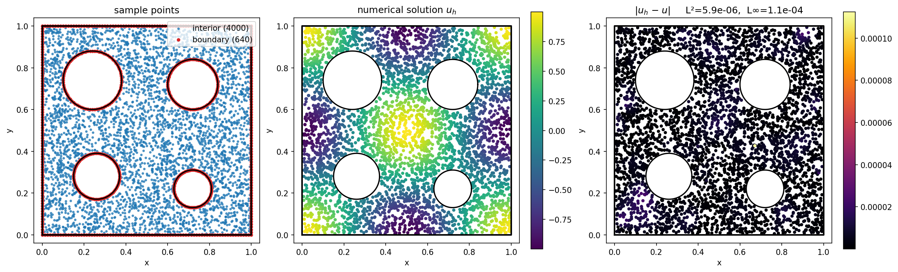 |
| 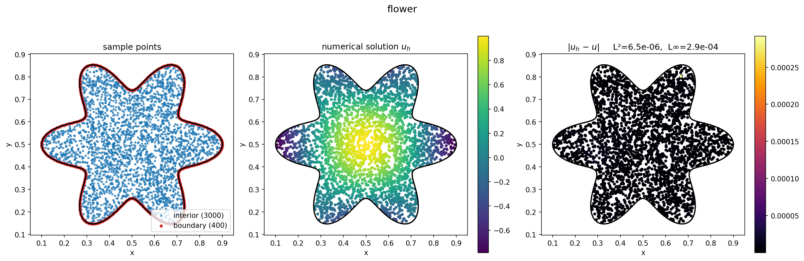   | 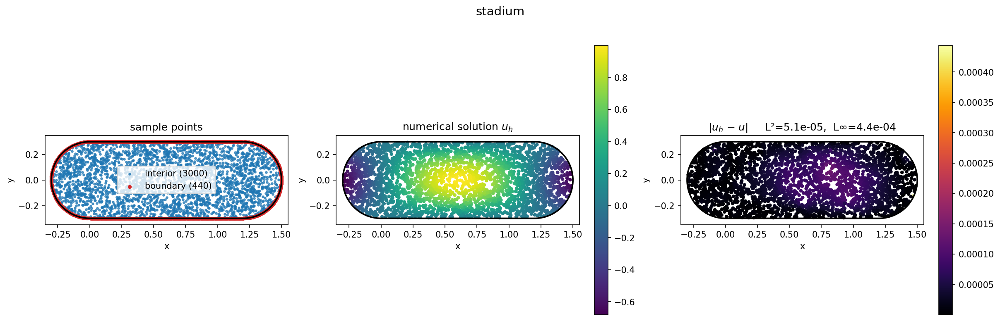   |
| 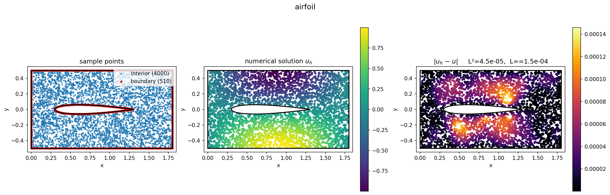 | 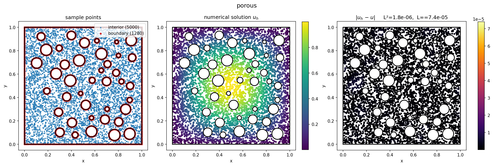     |
| 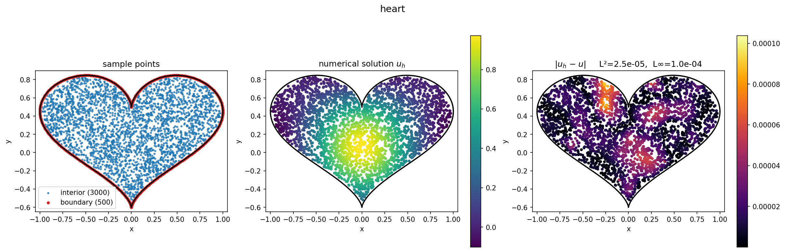     | 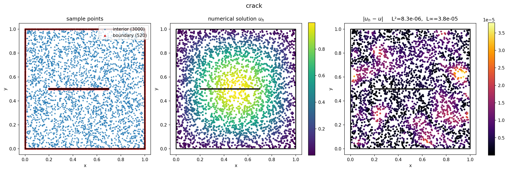       |
| 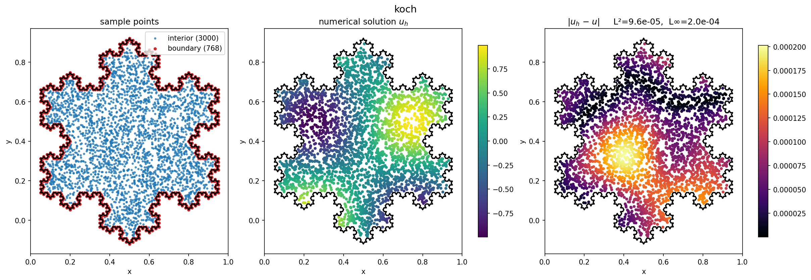       | 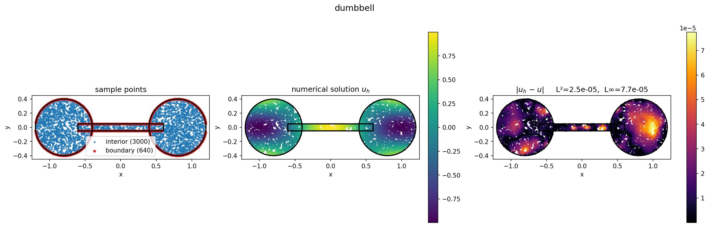 |

### 3D

The nonlinear elliptic solver is **dimension-agnostic** (Δδ kernel and
maximin ordering both work in any `d`). A d-general alias
`solve_nonlin_elliptic` is exported alongside `_2d`. Same function,
same ρ, 5k interior points except torus at 10k:

| script                                  | geometry                             | L²    |
| --------------------------------------- | ------------------------------------ | ----: |
| `torus_nonlin_elliptic.py`              | solid torus                          | 1e-4\*|
| `swiss_cheese_cube_nonlin_elliptic.py`  | cube with 6 spherical holes          | 2e-4  |
| `bowl_nonlin_elliptic.py`               | ball minus an off-centre ball        | 1e-4  |
| `schwarzp_nonlin_elliptic.py`           | Schwarz-P triply-periodic surface    | 1e-3  |
| `helix_nonlin_elliptic.py`              | thick helical tube                   | 3e-4  |
| `bunny_nonlin_elliptic.py`              | Stanford bunny (OBJ mesh)            | 6e-4  |
| `bracket_nonlin_elliptic.py`            | L-bracket + bolt holes via CSG       | 5e-6  |

\*10k points; rest 5k. Reaching 2D-level accuracy in 3D needs
roughly `N^{3/2}` points (~10⁵); 5k is enough to show the method
working, not the asymptotic regime.

|     |     |
| --- | --- |
| 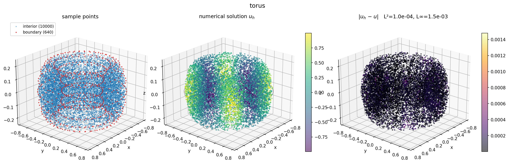       | 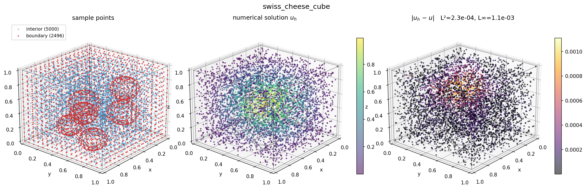 |
| 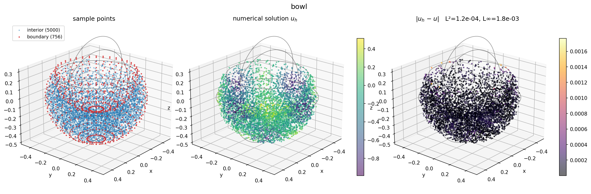         | 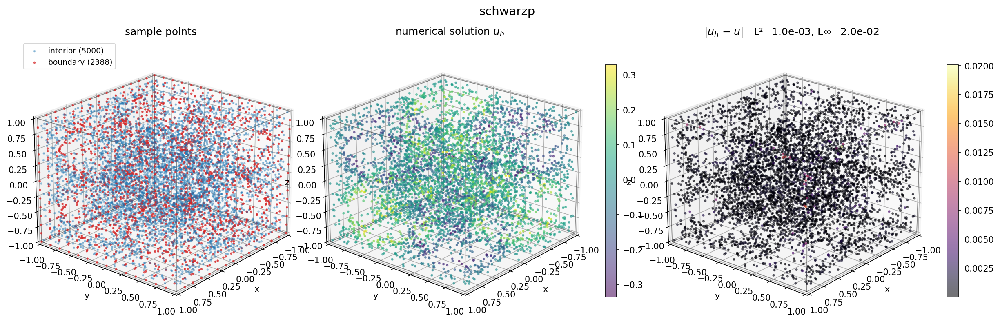 |
| 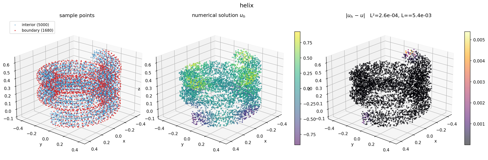       | 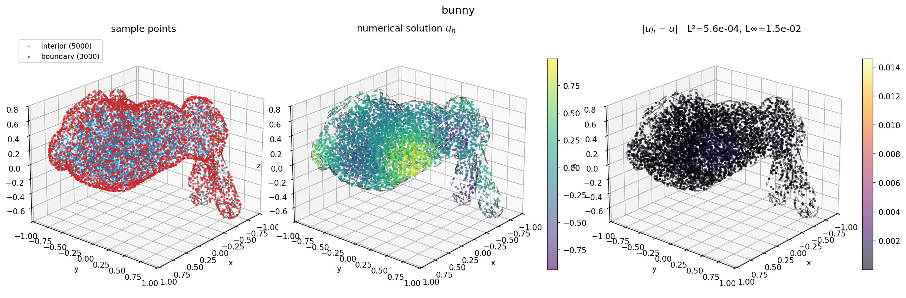        |
| 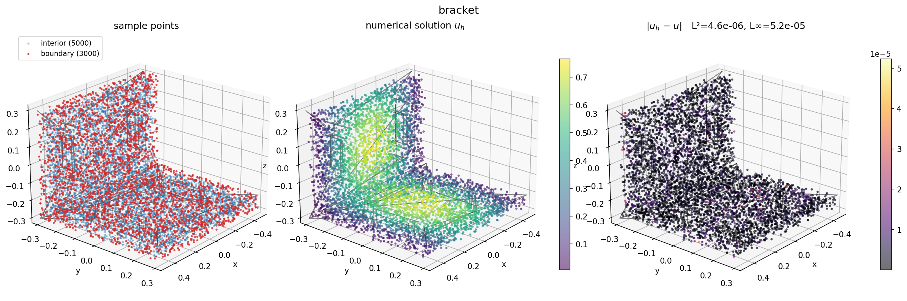   |                                 |

**Samplers used.** Implicit inequality (torus, bowl, Schwarz-P),
numerical projection onto `f(x)=0` (Schwarz-P surface), distance-to-
curve via `cKDTree` (helix), mesh `contains` + surface sampling
(bunny, via `trimesh`), and CSG boolean via `manifold3d` (L-bracket —
no STEP reader needed).

*Optional deps:* `trimesh + rtree` (bunny), `manifold3d` (bracket).

---

## Package layout

```
kolesky/
├── measurements.py      # PointMeasurement / Δδ / Δ∇δ / ∂∂ / ∂∂+δ dataclasses
├── covariance.py        # Matern 1/2 … 11/2 + Gaussian
├── ordering.py          # Reverse-maximin ordering via mutable max-heap
├── supernodes.py        # Supernodal reverse-maximin sparsity pattern
├── factorization.py     # Implicit / Explicit KLFactorization
└── pde/
    ├── pdes.py              # PDE dataclasses
    ├── sampling.py          # 1D / 2D grid + random sample-point helpers
    ├── pcg_ops.py           # BigFactorOperator, LiftedThetaTrainMatVec, SmallPrecond
    ├── nonlin_elliptic.py
    ├── varlin_elliptic.py
    ├── burgers.py
    └── monge_ampere.py

examples/    # one script per PDE and per geometry
tests/       # pytest smoke tests
docs/        # figure generation for this README
```

---

## Backends and timings

Every factorization / solver accepts `backend={'cpu', 'jax', 'auto'}`:

- `'cpu'` — NumPy + SciPy per supernode, thread-pooled over supernodes.
- `'jax'` — JAX with size-bucketed batched Cholesky; GPU if CUDA present.
- `'auto'` — `'jax'` if `jax.default_backend() != 'cpu'`, else `'cpu'`.

Environment knobs:

- `KOLESKY_NUM_THREADS` (default 32) — CPU thread-pool size per
  supernode.
- `KOLESKY_ENABLE_GPU_SPARSE=1` — opt into CuPy cuSPARSE triangular
  solves inside pCG. Only helpful for N ≫ 10⁴ (below that, CuPy re-runs
  cuSPARSE analysis every call and loses to SciPy).

**Warm timings** (JIT cache hot):

| example             | h      | N       | CPU¹   | GPU²   | L² error |
| ------------------- | :----- | ------: | -----: | -----: | -------: |
| `NonlinElliptic2d`  | 0.02   |  2 600  | 3.6 s  | 1.5 s  | ~2e-5    |
| `NonlinElliptic2d`  | 0.01   | 10 200  | 16.6 s | 6.0 s  | ~1e-5    |
| `VarLinElliptic2d`  | 0.05   |    520  | 1.0 s  | 0.3 s  | 3.7e-2   |
| `Burgers1d`, T=0.1  | 0.01   |    200  | 0.30 s | 0.3 s  | 5e-3     |
| `MongeAmpere2d`     | 0.1    |    120  | 0.47 s | 0.11 s | 1.5e-2   |

¹ `backend='cpu'`, 32-thread pool with OpenBLAS pinned to 1 thread per
worker (`pip install threadpoolctl`). AMD EPYC dual-socket.
² `backend='jax'` on a single NVIDIA H200 GPU. *Cold* first-call times
are larger due to per-supernode-size JIT compilation; `MongeAmpere2d`
cold is ~60 s (each pair evaluator fires `jax.hessian` calls). For
`Burgers1d` at N=200 there's no GPU win — per-call dispatch overhead
matches CPU SciPy.

GPU advantage grows with N: ~2.4× at N≈2 600, ~2.8× at N≈10 200 in the
`NonlinElliptic2d` column.

---

## License

MIT — see [LICENSE](LICENSE).
