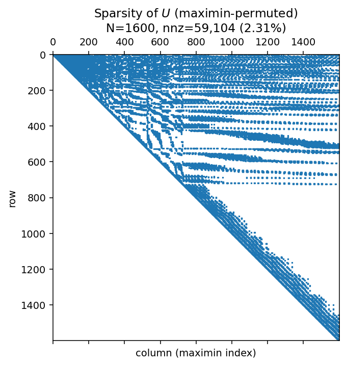
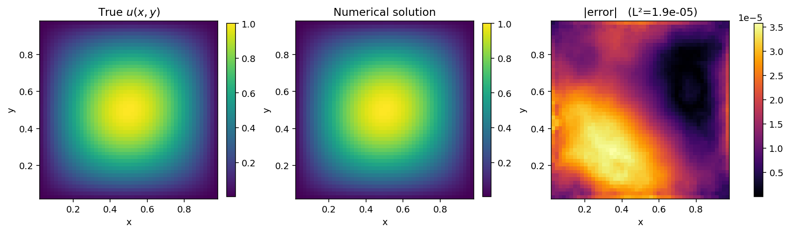
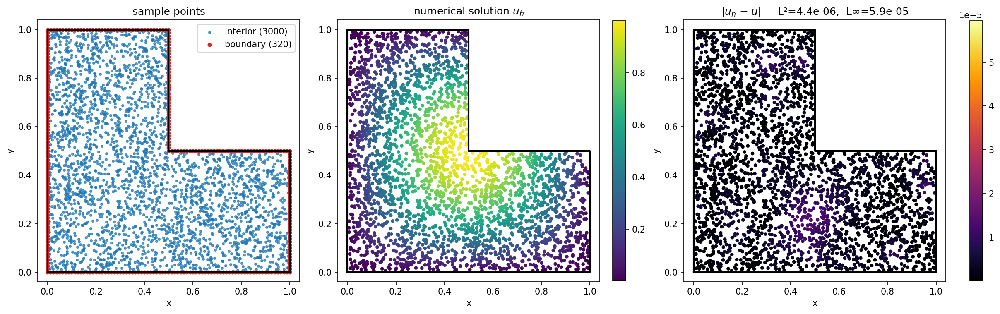

# GP-PDEs-SparseCholesky

Python package for solving nonlinear PDEs with Gaussian-process regression,
accelerated by sparse approximate-Cholesky factorization of kernel
matrices.

Two things in one repository:

1. **`kolesky`** — fast sparse Cholesky of covariance (kernel) matrices
   on point clouds, following the Kullback–Leibler-minimization ordering
   of Schäfer, Katzfuss, Owhadi (2020).
2. **`kolesky.pde`** — a GP + Gauss-Newton + preconditioned CG PDE solver
   that uses the factor as a preconditioner / implicit matvec, following
   Chen, Owhadi, Schäfer (2025).

Both are Python ports of the original Julia code:

* KoLesky.jl — [arXiv:2004.14455](https://arxiv.org/abs/2004.14455)
* PDEs-GP-KoleskySolver — [arXiv:2304.01294](https://arxiv.org/abs/2304.01294)

The original Julia source is preserved on the
[`initial-julia-code`](../../tree/initial-julia-code) branch.

```bibtex
@article{chen2025sparse,
  title={Sparse Cholesky factorization for solving nonlinear PDEs via Gaussian processes},
  author={Chen, Yifan and Owhadi, Houman and Sch{\"a}fer, Florian},
  journal={Mathematics of Computation},
  volume={94}, number={353}, pages={1235--1280}, year={2025}
}
```

## Installation

```bash
pip install -e .             # CPU only
pip install -e '.[gpu]'      # + JAX/CUDA + optional CuPy
```

Supports Python 3.10+. CPU works out of the box; GPU requires a JAX build
with CUDA.

---

## Part 1. Using `kolesky` on a kernel matrix

### The problem

Given `N` points `x_1, …, x_N ∈ R^d` and a kernel `K(x, y)` (e.g. Matérn
or Gaussian), the **kernel matrix** is `Θ ∈ R^{N×N}` with `Θ_{ij} =
K(x_i, x_j)`. Direct storage costs `O(N²)` and dense Cholesky costs
`O(N³)`. `kolesky` builds an approximate Cholesky factor `U`, sparse and
upper-triangular, such that

    Θ ≈ P  (Uᵀ U)⁻¹  Pᵀ            (Cholesky factor of Θ⁻¹, in permuted order)

where `P` is a permutation matrix that reorders the points from coarse
to fine (reverse-maximin ordering). Equivalently,

    Θ⁻¹ ≈ P  Uᵀ U  Pᵀ

Both `Uᵀ` and `U` are sparse; combined with the cheap `Uᵀ U` pattern,
the factor gives you `O(N · ρ^d)` storage and `O(N · ρ^{2d})` apply
cost, for a user-chosen accuracy parameter `ρ`.

### What you get

Three sparse objects live in an `ExplicitKLFactorization`:

* `U` — `scipy.sparse.csc_matrix`, upper-triangular, in P-permuted order
* `P` — `numpy.ndarray` (int64), the reverse-maximin permutation
* `kernel`, `measurements` — the kernel and (permuted) point cloud

From these you can cheaply compute

| operation                       | cost              | how                                                      |
| ------------------------------- | ----------------- | -------------------------------------------------------- |
| matvec `Θ v`                    | `O(N · ρ^d)`       | two sparse triangular solves on `U` (back + forward)    |
| solve `Θ x = b` (i.e. `Θ⁻¹ b`) | `O(N · ρ^d)`       | two sparse matvecs with `U`, `Uᵀ`                       |
| sample from `N(0, Θ)`           | `O(N · ρ^d)`       | solve `U ξ = z` for `z ∼ N(0, I)`                        |
| log-det                         | `O(N)`             | `−2 ∑ log U_{ii}`                                        |

All with one sparse factor, no dense inverse ever materialized.

### The ordering (why `P` matters)

The sparse factor is only well-approximated in a specific ordering — the
**reverse-maximin ordering**: iteratively pick the point farthest from
those already picked, until all points are placed. Coarse scales first,
fine scales last. Every factor / matvec routine in `kolesky` handles `P`
automatically, but whenever you use `U` yourself, **remember to
permute**: `Θ v ≈ P Uᵀ⁻¹ U⁻¹ Pᵀ v`.

### Quickstart

```python
import numpy as np
import scipy.sparse.linalg as spla
import kolesky as kl

# 40x40 grid on [0,1]² — 1600 points
xs = np.linspace(0.02, 0.98, 40)
X, Y = np.meshgrid(xs, xs, indexing='ij')
pts = np.stack([X.flatten(), Y.flatten()], axis=1)      # (1600, 2)

kernel       = kl.MaternCovariance5_2(length_scale=0.15)
measurements = kl.point_measurements(pts, dims=2)

# 1) build the ordering + sparsity pattern (O(N log N) CPU work)
implicit = kl.ImplicitKLFactorization.build(
    kernel, measurements, rho=3.0, k_neighbors=1,
)

# 2) materialize the factor (runs on GPU if JAX/CUDA is available)
explicit = kl.ExplicitKLFactorization(implicit, nugget=1e-8, backend='auto')

U, P = explicit.U, explicit.P
print(f'N = {U.shape[0]},  U.nnz = {U.nnz}  ({U.nnz/U.shape[0]**2:.1%} dense)')

# 3) use it: apply Θ v  (≈ P Uᵀ⁻¹ U⁻¹ Pᵀ v)
v = np.random.default_rng(0).standard_normal(U.shape[0])
vp = v[P]                                                # permute in
y  = spla.spsolve_triangular(U.tocsr(),   vp, lower=False)
z  = spla.spsolve_triangular(U.T.tocsr(), y,  lower=True)
Theta_v = np.empty_like(v); Theta_v[P] = z               # permute out

# sanity: compare to dense Θ @ v
Theta_v_dense = kernel(measurements) @ v
print('rel err:', np.linalg.norm(Theta_v - Theta_v_dense) / np.linalg.norm(Theta_v_dense))
```

The factor's upper-triangular sparsity after the maximin permutation
(produced by [`docs/make_figures.py`](docs/make_figures.py)):



Dense nnz would be `1600² = 2 560 000`. The sparse factor has ~59 000
nonzeros — **2.3 %** of the dense matrix — at the same ρ=3 used by the
PDE examples below. The nnz count grows only linearly in N — roughly
`O(N · ρᵈ)` total, `O(ρᵈ)` per column — so doubling N roughly halves
the density fraction. That's the whole point of the algorithm.

### Beyond point values: derivative measurements

Everything above works for **any** linear functional of the GP, not just
point evaluations `u(xᵢ)`. For PDE applications you usually need to
impose things like `Δu(xᵢ)` or `∂₁₁u(xᵢ)` — the same sparse-factor
machinery handles them transparently, because a linear functional `L`
of a GP is itself a GP and the covariance kernel `K(Lₓ, Lᵧ)` is obtained
by applying `L` twice to the original kernel.

| class                              | measurement                                               | used by                                   |
| ---------------------------------- | --------------------------------------------------------- | ----------------------------------------- |
| `PointMeasurement`                 | `u(x)`                                                    | any GP regression with point data         |
| `LaplaceDiracPointMeasurement`     | `w_Δ Δu(x) + w_δ u(x)`                                    | `NonLinElliptic2d`                        |
| `LaplaceGradDiracPointMeasurement` | `w_Δ Δu + ⟨w_∇, ∇u⟩ + w_δ u`, all at `x`                  | `VarLinElliptic2d`, `Burgers1d`           |
| `HessianDiracPointMeasurement`     | `w₁₁ ∂₁₁u + w₁₂ ∂₁₂u + w₂₂ ∂₂₂u + w_δ u`  (d=2)           | `MongeAmpere2d`                           |

These are *exactly* the linearizations you get by writing each PDE's
differential operator as a weighted sum of local measurements:

* `-Δu + α u^m = f`: after linearizing around `v`, the operator at `xᵢ`
  becomes `-Δu(xᵢ) + α·m·v^{m-1}(xᵢ) · u(xᵢ)` — a `Δδ` measurement.
* `-∇·(a∇u) + α u^m = f`: same idea but with a `Δ∇δ` measurement that
  picks up the `∇a(xᵢ)` gradient-contraction term.
* `u_t + u u_x - ν u_xx = 0` (Crank-Nicolson): a `Δ∇δ` measurement in
  1D.
* `det(∇²u) = f`: after linearization, `v_yy ∂₁₁u − 2 v_xy ∂₁₂u +
  v_xx ∂₂₂u` at each interior point — a `∂∂` measurement with `w_δ=0`.

Kernel evaluations, ordering, factorization, and solve all work
unchanged; you just feed the right measurement container in. Example —
one Dirichlet boundary + one Laplacian point, with the Matérn 5/2
kernel:

```python
import numpy as np, kolesky as kl
from kolesky import LaplaceDiracPointMeasurement

bdy_pt   = LaplaceDiracPointMeasurement(
    coordinate=np.array([[0.0, 0.0]]),
    weight_laplace=np.array([0.0]), weight_delta=np.array([1.0]),
)  #  u(0, 0)
interior = LaplaceDiracPointMeasurement(
    coordinate=np.array([[0.5, 0.5]]),
    weight_laplace=np.array([-1.0]), weight_delta=np.array([0.0]),
)  # -Δu(0.5, 0.5)
all_meas = kl.stack_measurements([bdy_pt, interior])
print(kl.MaternCovariance5_2(0.2)(all_meas))     # 2x2 covariance
```

---

## Part 2. Using `kolesky.pde` to solve PDEs

Every PDE in this package reduces a nonlinear problem to a sequence of
linear Gaussian-process regressions (Gauss-Newton), each of which is
solved with preconditioned conjugate gradient. The sparse factor plays
two roles in the pipeline:

1. as a fast **forward matvec** for `Θ_train @ v` without ever forming
   `Θ_train` (works because `Θ_train` is an inner-product block of a
   bigger `Θ_big`, whose factor is built once outside the GN loop), and
2. as the **preconditioner** `Θ_train⁻¹ ≈ Uᵀ U`.

All you have to supply is the PDE data (domain, right-hand side,
boundary data, and an initial iterate). Choose `backend='auto'` and the
heavy factorization work runs on GPU when available.

### How the measurements are ordered

For a single point cloud, reverse-maximin is unambiguous: pick the point
farthest from those already picked, repeat. For PDE problems you
typically have **several measurement groups at the same locations** —
e.g. both `u(xᵢ)` and `Δu(xᵢ)` at every interior point — so running
plain maximin on the concatenated list is ill-defined (distance zero
between a δ and its co-located Δδ). `kolesky` provides two canonical
multi-set orderings that `kolesky.pde` invokes for you:

* **FollowDiracs** (`ImplicitKLFactorization.build_follow_diracs`).
  Run maximin on `(boundary, interior_δ)`. Then, for each interior
  point, insert its derivative measurements **immediately after** its
  δ in the ordering. Effect: matching `δ / Δu` (or `δ / ∂∂u`) pairs
  end up in the same supernode, so the factor captures their strong
  co-dependence. Used by `NonLinElliptic2d` and `Burgers1d`.

* **DiracsFirstThenUnifScale** (`…build_diracs_first_then_unif_scale`).
  Same maximin-on-first-two-sets step, then concatenate each
  derivative block **at the end**, all at the finest length scale.
  Better when the spatial operator dominates (strongly oscillating
  coefficients, hard determinant nonlinearities). Used by
  `VarLinElliptic2d` and `MongeAmpere2d`.

Which variant each PDE uses is baked in; the choice is made randomly for each equation in the paper. The table below
summarizes:

| PDE              | ordering variant                | measurement sets in the "big" factor              |
| ---------------- | :------------------------------ | :------------------------------------------------ |
| NonLinElliptic2d | FollowDiracs (3 sets)           | boundary δ, interior δ, −Δ on interior            |
| VarLinElliptic2d | DiracsFirstThenUnifScale (3)    | boundary δ, interior δ, `−a∆ − ∇a·∇` on interior  |
| Burgers1d        | FollowDiracs (4 sets)           | boundary δ, interior δ, `∇_int`, `Δ_int`          |
| MongeAmpere2d    | DiracsFirstThenUnifScale (5)    | boundary δ, interior δ, `∂₁₁`, `∂₂₂`, `∂₁₂`        |

At each Gauss-Newton step, `kolesky.pde` reuses this "big" factor and
only rebuilds a small 2-set factor for `(boundary δ, linearized-PDE
measurement)` — at ρ_small and with the same ordering skeleton — to
serve as a preconditioner.

### Solving  `-Δu + α uᵐ = f`  on  `[0,1]²`

```python
import numpy as np
import kolesky as kl
from kolesky.pde import (
    NonlinElliptic2d, solve_nonlin_elliptic_2d, sample_points_grid_2d,
)

def u_exact(x):
    return float(np.sin(np.pi * x[0]) * np.sin(np.pi * x[1]))

def rhs(x):
    return 2 * np.pi**2 * u_exact(x) + u_exact(x) ** 3

eqn = NonlinElliptic2d(alpha=1.0, m=3, domain=((0, 1), (0, 1)),
                        bdy=u_exact, rhs=rhs)
X_dom, X_bdy = sample_points_grid_2d(eqn.domain, 0.02, 0.02)
kernel = kl.MaternCovariance7_2(length_scale=0.3)

sol = solve_nonlin_elliptic_2d(
    eqn, kernel, X_dom, X_bdy, sol_init=np.zeros(X_dom.shape[0]),
    GN_steps=3, rho_big=3, rho_small=3, k_neighbors=3,
    backend='auto',
)
```

Ground truth vs numerical solution on a 50×50 grid — Matern 7/2 kernel,
3 Gauss-Newton steps, ρ = 3:



### Complicated geometries — the mesh-free advantage

The solver takes raw point arrays, not meshes. To change the geometry
you just change how you sample `X_domain` and `X_boundary` — everything
downstream (maximin ordering, sparse factorization, Gauss-Newton, pCG)
runs unchanged. A **single-file L-shape demo** is included:

```bash
python examples/lshape_nonlin_elliptic.py --N-interior 3000 --backend cpu
```

Same PDE as above (`-Δu + u³ = f` with manufactured solution
`u = sin πx · sin πy`), but posed on the classic re-entrant
`Ω = [0, 1]² \ [0.5, 1]²`. The interior is rejection-sampled uniformly;
boundary points are parametric along the six edges.



The whole solve takes **~9 s on CPU** (3000 interior + 320 boundary
points, Matern 7/2, ρ = 3, 3 Gauss-Newton steps) and reaches **L² ≈
4·10⁻⁶, L∞ ≈ 6·10⁻⁵**. No mesh, no element assembly, no need to
re-derive anything — the machinery for rectangular domains is the
machinery for L-shapes, disks, polygons with holes, or point clouds
straight out of a CAD tool.

### Other PDEs

```python
from kolesky.pde import (
    VarLinElliptic2d, solve_var_lin_elliptic_2d,   # -∇·(a∇u) + α uᵐ = f
    Burgers1d,        solve_burgers_1d,             # u_t + u u_x - ν u_xx = 0
    MongeAmpere2d,    solve_monge_ampere_2d,        # det(∇²u) = f
)
```

See [`examples/`](examples/) for runnable command-line scripts that
mirror the Julia reference code.

---

## Package layout

```
kolesky/
├── measurements.py      # Point / Δδ / Δ∇δ / ∂∂ / ∂∂+δ measurement dataclasses
├── covariance.py        # Matern 1/2 … 11/2 + Gaussian kernels
├── ordering.py          # Reverse-maximin ordering via mutable max-heap
├── supernodes.py        # Supernodal reverse-maximin sparsity pattern
├── factorization.py     # ImplicitKLFactorization / ExplicitKLFactorization
└── pde/
    ├── pdes.py          # PDE dataclasses
    ├── sampling.py      # 1D / 2D grid + random sample-point helpers
    ├── pcg_ops.py       # BigFactorOperator, LiftedThetaTrainMatVec, SmallPrecond
    ├── nonlin_elliptic.py
    ├── varlin_elliptic.py
    ├── burgers.py
    └── monge_ampere.py

examples/                # command-line scripts (mirror the Julia mainfiles)
tests/                   # pytest smoke tests
docs/                    # figure generation for this README
```

## Backends

Every factorization / solver accepts `backend={'cpu', 'jax', 'auto'}`:

* `'cpu'` — NumPy + SciPy per supernode, thread-pooled over supernodes.
* `'jax'` — JAX with size-bucketed batched Cholesky. Runs on GPU
  automatically if JAX is built with CUDA and resolves to a GPU device.
* `'auto'` (default) — `'jax'` if `jax.default_backend() != 'cpu'`,
  else `'cpu'`.

Tuning knobs (environment variables):

* `KOLESKY_NUM_THREADS` (default 32) — CPU thread-pool size for
  per-supernode factorization.
* `KOLESKY_ENABLE_GPU_SPARSE=1` — opt-in CuPy-backed sparse triangular
  solves inside pCG. Useful only for N ≫ 10⁴; for smaller N, CuPy's
  `spsolve_triangular` re-runs cuSPARSE analysis on every call and
  loses to SciPy in practice.

## Reference timings (steady-state, after JAX JIT cache is warm)

| example              | grid      | N      | CPU warm¹ | GPU warm² | L² error |
| -------------------- | :-------- | -----: | --------: | --------: | -------: |
| NonLinElliptic2d     | h = 0.02  |  2 600 |     3.6 s |     1.5 s |   ~2e-5  |
| NonLinElliptic2d     | h = 0.01  | 10 200 |    16.6 s |     6.0 s |   ~1e-5  |
| VarLinElliptic2d     | h = 0.05  |    520 |     1.0 s |     0.3 s |   3.7e-2 |
| Burgers1d, T = 0.1   | h = 0.01  |    200 |    0.30 s |     0.3 s |   5e-3   |
| MongeAmpere2d        | h = 0.1   |    120 |    0.47 s |    0.11 s |   1.5e-2 |

¹ `backend='cpu'`, 32-thread pool with OpenBLAS pinned to 1 thread per
worker (requires `pip install threadpoolctl`). Machine: dual-socket
server, AMD EPYC class.
² `backend='jax'` on a single NVIDIA H200 GPU. *Cold* (first-call) times
are larger because JAX JIT-compiles the bucket kernel once per
supernode-size bucket; the cost persists within a single Python
process. MongeAmpere's cold time is especially large (~60 s) because
each pair evaluator fires several `jax.hessian` calls plus a
Hessian-of-Hessian. For the small 1-D Burgers example there's no GPU
win — the per-call dispatch overhead matches CPU scipy.

The GPU advantage grows with N (larger batched supernodes amortize
dispatch / kernel-launch overhead): ~2.4× at N≈2 600, ~2.8× at
N≈10 200 in the NonLinElliptic column above.

## License

MIT — see [LICENSE](LICENSE).
